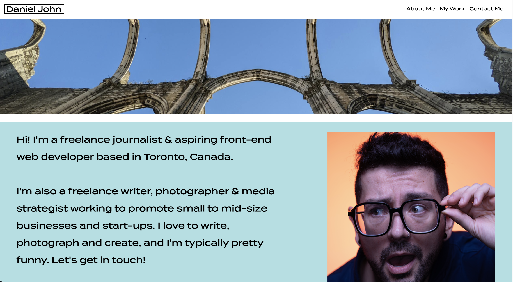
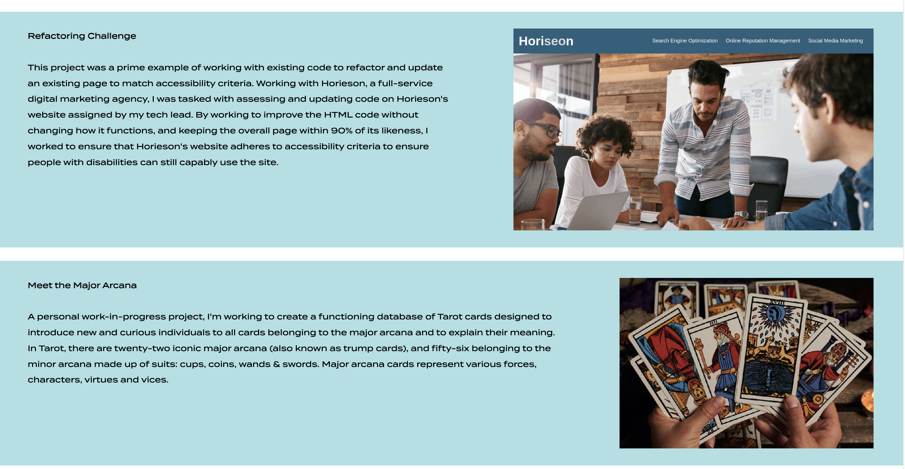
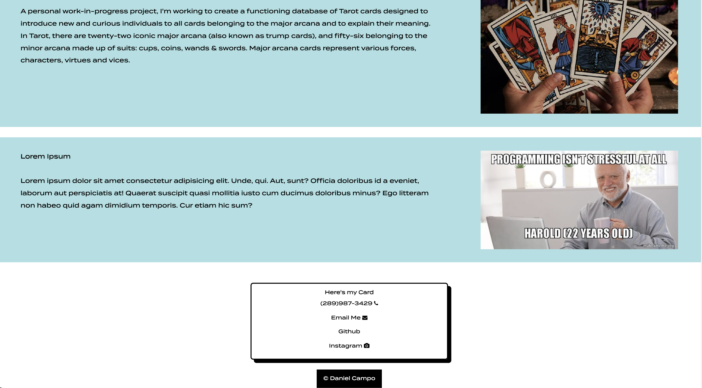

# Advanced-CSS // Build A Portfolio
##### _Languages & Tools Used_ 🛠

#### _Links_
* <a href="https://github.com/F3N215/Portfolio-Challenge/blob/main/index.html">HTML</a>
* <a href="https://github.com/F3N215/Portfolio-Challenge/blob/main/assets/css/style.css">CSS</a>

-----
## Project Summary 📋
* Without any starter code, we are tasked with creating a personal portfolio from scratch to showcase our work using semantic HTML and advanced CSS techniques.
* The finished product can then be reworked and updated in the future by adding new applications and projects. It can also be reworked and improved as our skills and knowledge increase throughout the course.

-----
## Summary of Changes 📝
* Added a navbar with my name/logo and links to relevant sections on the page.
* Added link hover elements to the navbar links.
* Navbar links jump to each individual section when clicked on.
* First completed project, the Refactoring Challenge, is larger in size versus other projects.
* Manufactured a GIF file out of my Refactoring Challenge screenshot, to better showcase my work.
* Added my own photograph as a Hero banner element beneath the navbar.
* Added detailed about me section with a recent photograph.
* Added drop shadow effects to the Contact Me section to resemble a business card. 
* Comments added to CSS consolidation for faster navigation.
* Comments added to HTML for better organization.
* Used Chrome extension WAVE to test final page for accessibility.

-----
## Screenshots 📸

-----
## About Me
<h3 align="left">Hey there! I'm Dan 👋 I'm a junior fullstack webdev</h3>

* 🔭 I’m currently working on occult projects, SMBs & personal pages
* 🌱 I’m currently learning HTML5, CSS, & JavaScript
* 📫 Email me **dcampo85@gmail.com**

<h6 align="left">Connect with me:</h6>

